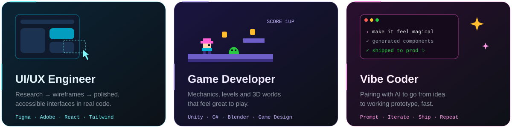
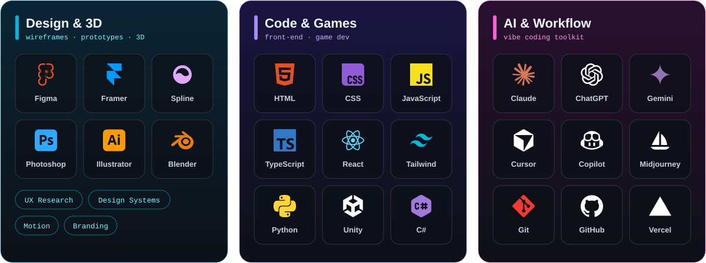

<!-- ═════════════════════════════ HERO ═════════════════════════════ -->

  

 

<!-- invisible counter that records profile views; the stat cards above read its total -->

  

  
<!-- ═════════════════════════════ WHAT I DO ═════════════════════════════ -->

  
💼 UI/UX Engineer &amp; Game Developer at <b>Funextreme Technology LLC</b> 
🎓 Graduate of <b>BSc (Hons) Computer Security</b>, University of Plymouth (UK) 
🌱 Exploring game design, motion, 3D and AI-powered workflows
  

  
<!-- ═════════════════════════════ STACK ═════════════════════════════ -->

  

  
<!-- ═════════════════════════════ STATS ═════════════════════════════ -->

 

 

  

  
<!-- ═════════════════════════════ SNAKE ═════════════════════════════ -->
<picture>
  <source media="(prefers-color-scheme: dark)" srcset="https://raw.githubusercontent.com/ruchira-edirisinghe/ruchira-edirisinghe/output/github-snake-dark.svg" />
  <source media="(prefers-color-scheme: light)" srcset="https://raw.githubusercontent.com/ruchira-edirisinghe/ruchira-edirisinghe/output/github-snake.svg" />
  
</picture>
  
<!-- ═════════════════════════════ FOOTER ═════════════════════════════ -->

