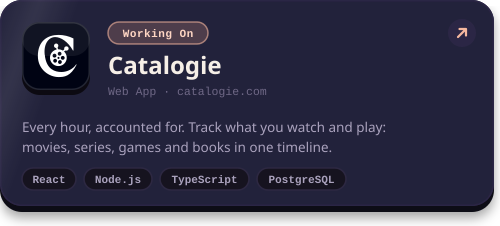
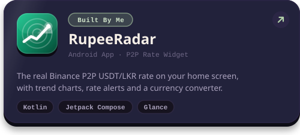
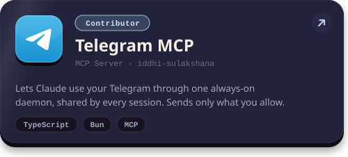
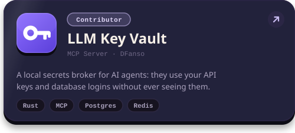

<!-- The artwork in assets/ is drawn by .github/scripts/draw_assets.py; the stats, streak, languages and snake are
     redrawn every 3 hours by .github/workflows/profile-assets.yml (stat_cards.py, frame_snake.py) into the output branch.
     Spacing: every block is its own 
 (GitHub gives a bare  line no margin but a paragraph 16px), with no
       spacers, and every image leaves the same clear space (theme.PAD) under itself, so the gaps all match.
     Width: every block is 88% wide (the link tiles 22% each) so it spans exactly the dividers' dotted line
     (theme.NARROW); the dividers themselves stay at 100%. -->

<!-- invisible counter that records profile views; the stats above read its total -->

